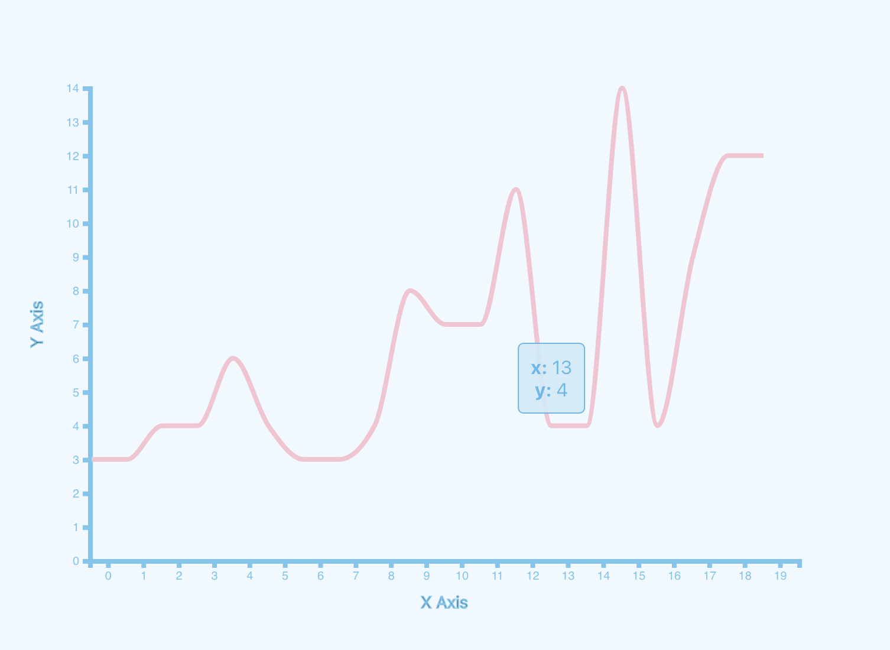
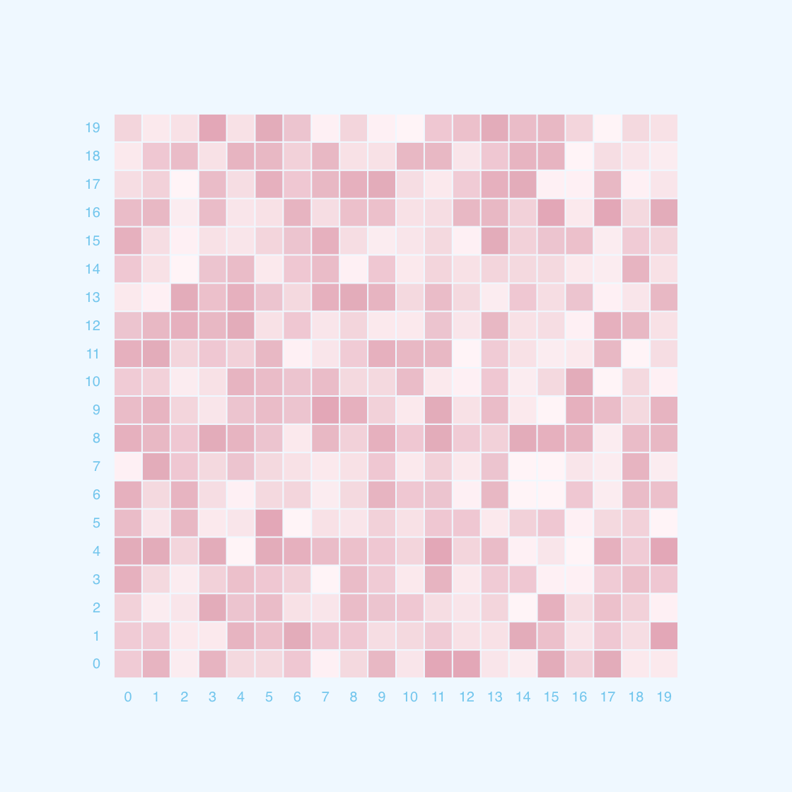
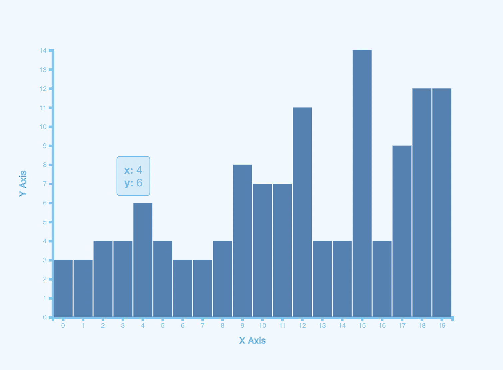
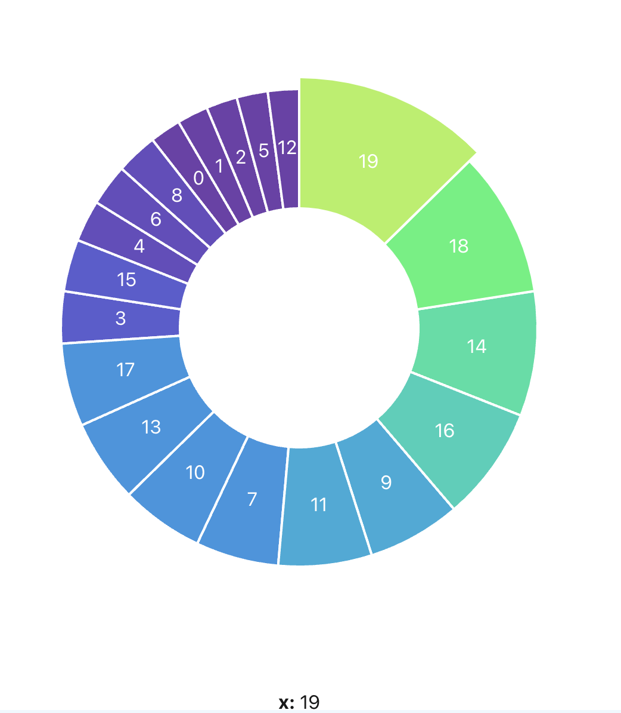
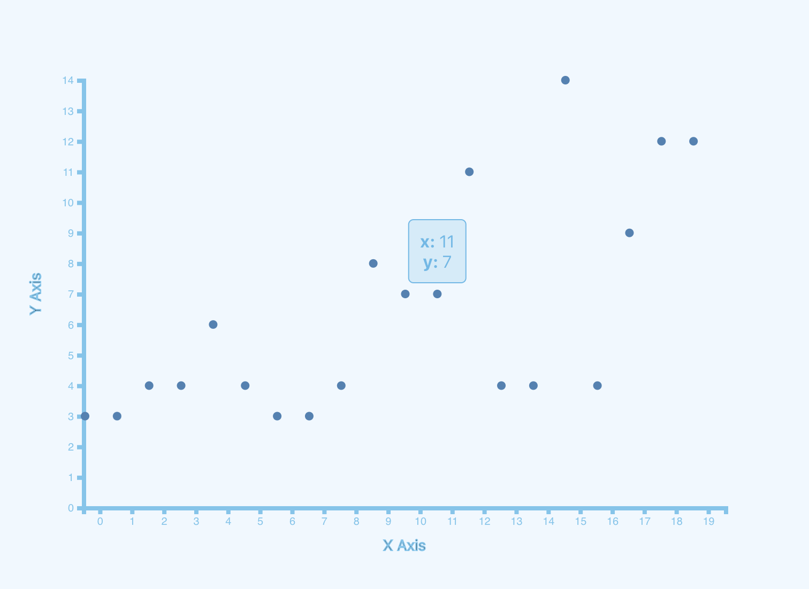
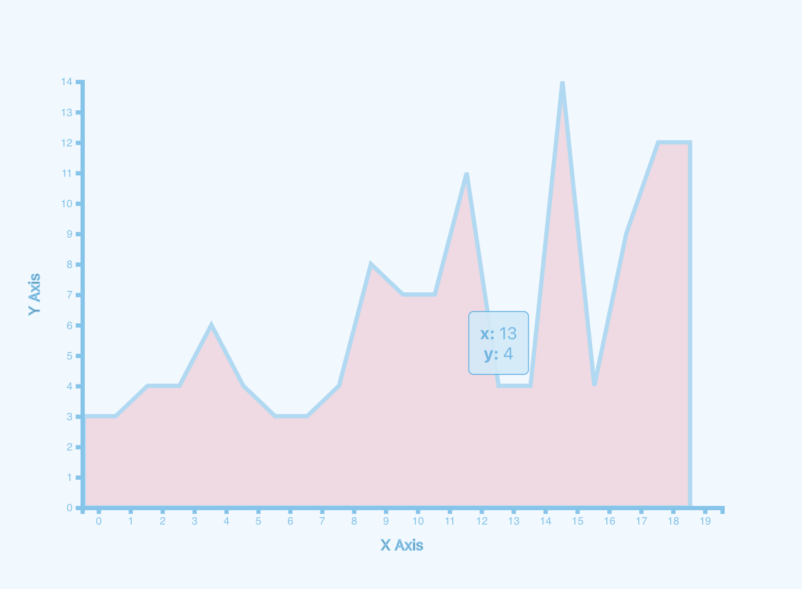

# Setup Instructions

First time:

```
docker-compose up --build
```

Start container:

```
docker-compose up
```

Exec into container:

```
docker-compose exec javascript exec
```

# Usage

## LineChart

```js
<LineChart
  svgProps={{
    margin: { top: 80, bottom: 80, left: 80, right: 80 },
    width: 600,
    height: 400,
  }}
  axisProps={{
    xLabel: 'X Axis',
    yLabel: 'Y Axis',
  }}
  data={data}
  strokeWidth={4}
/>
```



## Heat Map

```js
<HeatMap
  svgProps={{
    margin: { top: 80, bottom: 80, left: 80, right: 80 },
    width: 400,
    height: 400,
  }}
  axisProps={{
    xLabel: 'X Axis',
    yLabel: 'Y Axis',
  }}
  data={heatMapdata}
  strokeWidth={4}
/>
```



## Bar Chart

```js
<BarChart
  svgProps={{
    margin: { top: 80, bottom: 80, left: 80, right: 80 },
    width: 600,
    height: 400,
  }}
  axisProps={{
    xLabel: 'X Axis',
    yLabel: 'Y Axis',
  }}
  data={data}
  strokeWidth={4}
/>
```



## Pie Chart

```js
<PieChart
  data={data}
  pieSize={400}
  svgSize={500}
  innerRadius={100}
  containerId="pie"
/>
```



## Scatter Plot

```js
<ScatterPlot
  svgProps={{
    margin: { top: 80, bottom: 80, left: 80, right: 80 },
    width: 600,
    height: 400,
  }}
  axisProps={{
    xLabel: 'X Axis',
    yLabel: 'Y Axis',
  }}
  data={data}
  pointWidth={4}
/>
```



## Area Chart

```js
<AreaChart
  svgProps={{
    margin: { top: 80, bottom: 80, left: 80, right: 80 },
    width: 600,
    height: 400,
  }}
  axisProps={{
    xLabel: 'X Axis',
    yLabel: 'Y Axis',
  }}
  data={data}
  strokeWidth={4}
/>
```


